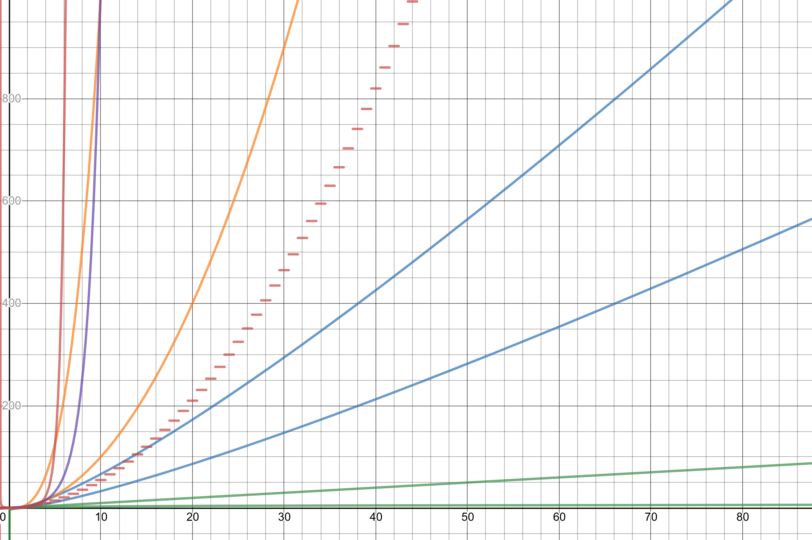

# learn_cpp

A compilation of solutions to competative programming problems, especially from low level USACO and 115.236.49.52:83.

My complexities graph can be found here: <https://www.desmos.com/calculator/bhq70wfqsx>.

